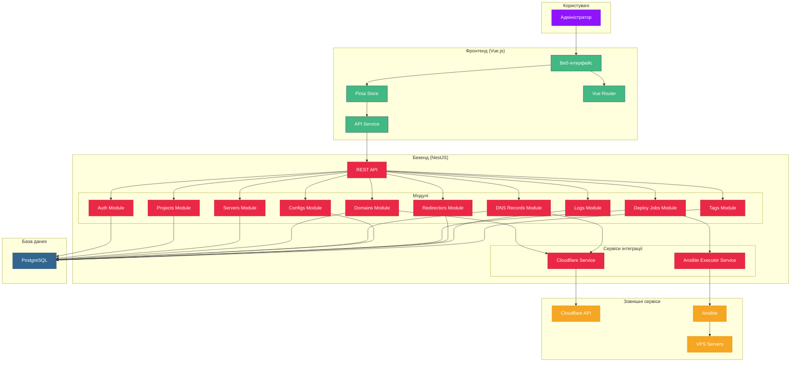

# Архітектурна діаграма RokoCDN

Ця діаграма відображає основні компоненти системи RokoCDN та їх взаємодію.

## Загальна архітектура системи

## Опис компонентів

### Фронтенд
- **Веб-інтерфейс (UI)**: Vue.js компоненти для взаємодії з користувачем
- **Pinia Store**: Управління станом додатку
- **Vue Router**: Маршрутизація між сторінками
- **API Service**: Сервіс для взаємодії з бекендом

### Бекенд
- **REST API**: Основний інтерфейс для взаємодії з фронтендом
- **Модулі**: Функціональні модулі системи (Auth, Projects, Servers, Domains, DNS Records, Configs, Deploy Jobs, Redirectors, Logs, Tags)
- **Сервіси інтеграції**: Сервіси для взаємодії з зовнішніми системами (Cloudflare, Ansible)

### База даних
- **PostgreSQL**: Реляційна база даних для зберігання всіх даних системи

### Зовнішні сервіси
- **Cloudflare API**: API для управління DNS-записами
- **Ansible**: Інструмент для автоматизації розгортання
- **VPS Servers**: Віртуальні сервери для розгортання дзеркал та редиректорів