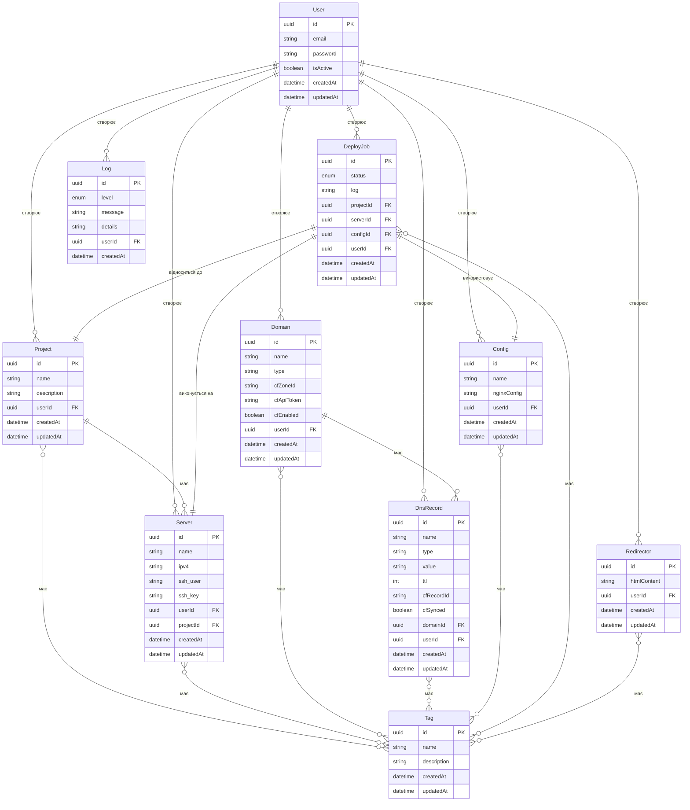

# ER-діаграма RokoCDN

Ця діаграма відображає модель даних системи RokoCDN та зв'язки між сутностями.

## Модель даних

## Опис сутностей

### User (Користувач)
Представляє адміністратора системи, який має доступ до панелі управління.

### Project (Проект)
Представляє проект, для якого створюються дзеркала, проксі або редиректори.

### Server (Сервер)
Представляє VPS-сервер, на якому розгортаються дзеркала, проксі або редиректори.

### Domain (Домен)
Представляє доменне ім'я, яке використовується для доступу до дзеркала, проксі або редиректора.

### DnsRecord (DNS-запис)
Представляє DNS-запис, який пов'язує доменне ім'я з IP-адресою сервера.

### Config (Конфігурація)
Представляє конфігурацію Nginx для дзеркала, проксі або редиректора.

### DeployJob (Завдання розгортання)
Представляє завдання розгортання дзеркала, проксі або редиректора на сервері.

### Redirector (Редиректор)
Представляє редиректор, який перенаправляє користувачів з одного домену на інший.

### Log (Журнал)
Представляє запис у журналі подій системи.

### Tag (Тег)
Представляє тег, який може бути присвоєний різним сутностям для їх категоризації.