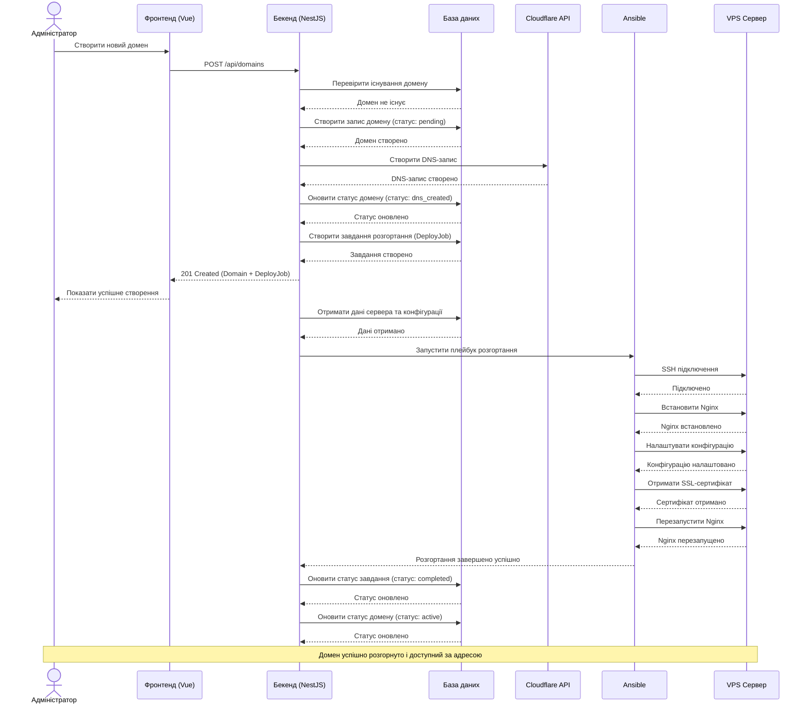

# Діаграма послідовності розгортання домену в RokoCDN

Ця діаграма відображає процес створення та розгортання нового домену в системі RokoCDN.

## Процес розгортання домену

## Опис процесу

1. **Ініціювання**: Адміністратор через веб-інтерфейс створює новий домен.
2. **Валідація**: Бекенд перевіряє, чи не існує вже такий домен.
3. **Створення DNS**: Бекенд створює DNS-запис через Cloudflare API.
4. **Створення завдання**: Бекенд створює завдання розгортання (DeployJob).
5. **Підготовка даних**: Бекенд отримує дані сервера та конфігурації.
6. **Розгортання**: Ansible виконує плейбук для налаштування сервера:
   - Встановлення Nginx
   - Налаштування конфігурації
   - Отримання SSL-сертифіката
   - Перезапуск Nginx
7. **Завершення**: Бекенд оновлює статуси завдання та домену.

Після успішного завершення всіх етапів, домен стає доступним за вказаною адресою.