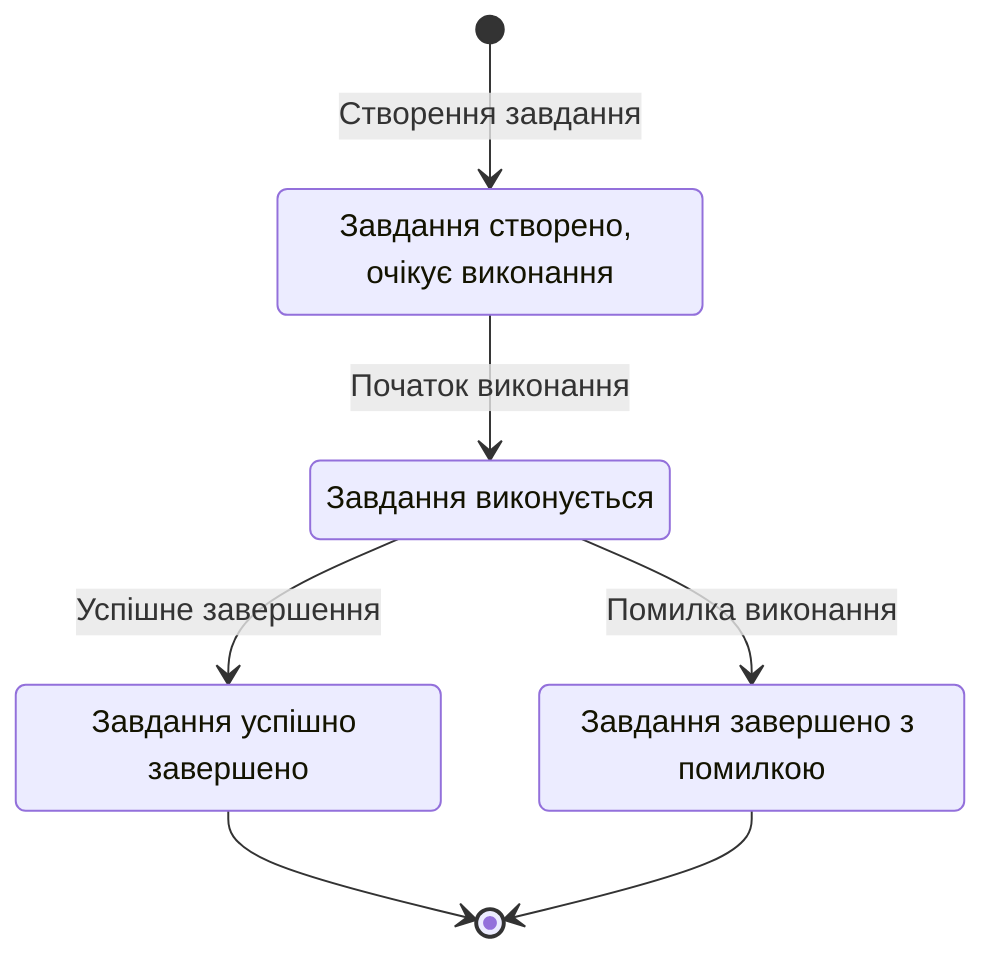

# Діаграма станів завдання розгортання в RokoCDN

Ця діаграма відображає життєвий цикл завдання розгортання (DeployJob) в системі RokoCDN.

## Життєвий цикл DeployJob

## Опис станів

### Pending (Очікування)
Початковий стан завдання після його створення. Завдання знаходиться в черзі на виконання.

### InProgress (Виконується)
Стан, в якому завдання активно виконується. В цьому стані відбувається:
- Підключення до сервера через SSH
- Виконання Ansible плейбука
- Налаштування Nginx
- Отримання SSL-сертифіката
- Інші операції розгортання

### Completed (Завершено)
Кінцевий стан для успішно виконаних завдань. Означає, що всі операції розгортання були виконані без помилок.

### Failed (Помилка)
Кінцевий стан для завдань, які завершилися з помилкою. Причини можуть бути різними:
- Неможливість підключитися до сервера
- Помилки при встановленні програмного забезпечення
- Помилки при налаштуванні Nginx
- Помилки при отриманні SSL-сертифіката
- Інші помилки розгортання

## Переходи між станами

1. **Створення завдання**: Завдання створюється в стані Pending.
2. **Початок виконання**: Коли система починає обробку завдання, воно переходить у стан InProgress.
3. **Успішне завершення**: Якщо всі операції розгортання виконані успішно, завдання переходить у стан Completed.
4. **Помилка виконання**: Якщо під час виконання виникла помилка, завдання переходить у стан Failed.

## Додаткова інформація

Кожен перехід між станами супроводжується оновленням запису в базі даних та додаванням відповідного запису в журнал подій системи. Це дозволяє відстежувати історію виконання завдань та аналізувати причини помилок.