# Діаграма потоків даних в RokoCDN

Ця діаграма відображає потоки даних між компонентами системи RokoCDN.

## Потоки даних

```mermaid
flowchart TD
    subgraph "Користувачі"
        Admin["Адміністратор"]
    end

    subgraph "Фронтенд"
        UI["Веб-інтерфейс"]
        API_Client["API Client"]
    end

    subgraph "Бекенд"
        API_Gateway["API Gateway"]
        
        subgraph "Контролери"
            AuthController["AuthController"]
            ProjectsController["ProjectsController"]
            ServersController["ServersController"]
            DomainsController["DomainsController"]
            DnsRecordsController["DnsRecordsController"]
            ConfigsController["ConfigsController"]
            DeployJobsController["DeployJobsController"]
            RedirectorsController["RedirectorsController"]
            LogsController["LogsController"]
            TagsController["TagsController"]
        end
        
        subgraph "Сервіси"
            AuthService["AuthService"]
            ProjectsService["ProjectsService"]
            ServersService["ServersService"]
            DomainsService["DomainsService"]
            DnsRecordsService["DnsRecordsService"]
            ConfigsService["ConfigsService"]
            DeployJobsService["DeployJobsService"]
            RedirectorsService["RedirectorsService"]
            LogsService["LogsService"]
            TagsService["TagsService"]
            CloudflareService["CloudflareService"]
            AnsibleService["AnsibleService"]
        end
        
        subgraph "Репозиторії"
            UserRepo["UserRepository"]
            ProjectRepo["ProjectRepository"]
            ServerRepo["ServerRepository"]
            DomainRepo["DomainRepository"]
            DnsRecordRepo["DnsRecordRepository"]
            ConfigRepo["ConfigRepository"]
            DeployJobRepo["DeployJobRepository"]
            RedirectorRepo["RedirectorRepository"]
            LogRepo["LogRepository"]
            TagRepo["TagRepository"]
        end
    end

    subgraph "База даних"
        PostgreSQL["PostgreSQL"]
    end

    subgraph "Зовнішні сервіси"
        Cloudflare["Cloudflare API"]
        Ansible["Ansible"]
        VPS["VPS Servers"]
    end

    %% Потоки даних від користувача до фронтенду
    Admin -- "Дії користувача\n(клік, введення даних)" --> UI
    UI -- "HTTP запити" --> API_Client
    
    %% Потоки даних між фронтендом і бекендом
    API_Client -- "REST API запити" --> API_Gateway
    API_Gateway -- "HTTP відповіді" --> API_Client
    
    %% Потоки даних між API Gateway і контролерами
    API_Gateway -- "Запити авторизації" --> AuthController
    API_Gateway -- "Запити проектів" --> ProjectsController
    API_Gateway -- "Запити серверів" --> ServersController
    API_Gateway -- "Запити доменів" --> DomainsController
    API_Gateway -- "Запити DNS-записів" --> DnsRecordsController
    API_Gateway -- "Запити конфігурацій" --> ConfigsController
    API_Gateway -- "Запити завдань розгортання" --> DeployJobsController
    API_Gateway -- "Запити редиректорів" --> RedirectorsController
    API_Gateway -- "Запити журналів" --> LogsController
    API_Gateway -- "Запити тегів" --> TagsController
    
    %% Потоки даних між контролерами і сервісами
    AuthController -- "Виклики методів" --> AuthService
    ProjectsController -- "Виклики методів" --> ProjectsService
    ServersController -- "Виклики методів" --> ServersService
    DomainsController -- "Виклики методів" --> DomainsService
    DnsRecordsController -- "Виклики методів" --> DnsRecordsService
    ConfigsController -- "Виклики методів" --> ConfigsService
    DeployJobsController -- "Виклики методів" --> DeployJobsService
    RedirectorsController -- "Виклики методів" --> RedirectorsService
    LogsController -- "Виклики методів" --> LogsService
    TagsController -- "Виклики методів" --> TagsService
    
    %% Потоки даних між сервісами і репозиторіями
    AuthService -- "Запити даних" --> UserRepo
    ProjectsService -- "Запити даних" --> ProjectRepo
    ServersService -- "Запити даних" --> ServerRepo
    DomainsService -- "Запити даних" --> DomainRepo
    DnsRecordsService -- "Запити даних" --> DnsRecordRepo
    ConfigsService -- "Запити даних" --> ConfigRepo
    DeployJobsService -- "Запити даних" --> DeployJobRepo
    RedirectorsService -- "Запити даних" --> RedirectorRepo
    LogsService -- "Запити даних" --> LogRepo
    TagsService -- "Запити даних" --> TagRepo
    
    %% Потоки даних між репозиторіями і базою даних
    UserRepo -- "SQL запити" --> PostgreSQL
    ProjectRepo -- "SQL запити" --> PostgreSQL
    ServerRepo -- "SQL запити" --> PostgreSQL
    DomainRepo -- "SQL запити" --> PostgreSQL
    DnsRecordRepo -- "SQL запити" --> PostgreSQL
    ConfigRepo -- "SQL запити" --> PostgreSQL
    DeployJobRepo -- "SQL запити" --> PostgreSQL
    RedirectorRepo -- "SQL запити" --> PostgreSQL
    LogRepo -- "SQL запити" --> PostgreSQL
    TagRepo -- "SQL запити" --> PostgreSQL
    
    %% Потоки даних між сервісами і зовнішніми сервісами
    DomainsService -- "Запити на створення/оновлення DNS" --> CloudflareService
    DnsRecordsService -- "Запити на створення/оновлення DNS" --> CloudflareService
    DeployJobsService -- "Запити на розгортання" --> AnsibleService
    
    %% Потоки даних між сервісами інтеграції і зовнішніми сервісами
    CloudflareService -- "HTTP API запити" --> Cloudflare
    AnsibleService -- "Виклики Ansible" --> Ansible
    Ansible -- "SSH команди" --> VPS
    
    %% Стилі для різних груп компонентів
    classDef frontend fill:#42b883,stroke:#35495e,color:white;
    classDef backend fill:#ea2845,stroke:#c5162e,color:white;
    classDef database fill:#326690,stroke:#254e6c,color:white;
    classDef external fill:#f5a623,stroke:#e09612,color:white;
    classDef user fill:#9013fe,stroke:#7311c7,color:white;

    class UI,API_Client frontend;
    class API_Gateway,AuthController,ProjectsController,ServersController,DomainsController,DnsRecordsController,ConfigsController,DeployJobsController,RedirectorsController,LogsController,TagsController,AuthService,ProjectsService,ServersService,DomainsService,DnsRecordsService,ConfigsService,DeployJobsService,RedirectorsService,LogsService,TagsService,CloudflareService,AnsibleService,UserRepo,ProjectRepo,ServerRepo,DomainRepo,DnsRecordRepo,ConfigRepo,DeployJobRepo,RedirectorRepo,LogRepo,TagRepo backend;
    class PostgreSQL database;
    class Cloudflare,Ansible,VPS external;
    class Admin user;
```

## Опис потоків даних

### Взаємодія користувача з системою
1. Адміністратор взаємодіє з веб-інтерфейсом через браузер.
2. Веб-інтерфейс відправляє HTTP-запити до бекенду через API-клієнт.

### Обробка запитів на бекенді
1. API Gateway отримує запити від фронтенду і направляє їх до відповідних контролерів.
2. Контролери викликають методи відповідних сервісів для обробки бізнес-логіки.
3. Сервіси взаємодіють з репозиторіями для отримання або зміни даних.
4. Репозиторії виконують SQL-запити до бази даних PostgreSQL.

### Взаємодія з зовнішніми сервісами
1. CloudflareService відправляє HTTP-запити до Cloudflare API для управління DNS-записами.
2. AnsibleService викликає Ansible для розгортання конфігурацій на серверах.
3. Ansible виконує SSH-команди на VPS-серверах для налаштування програмного забезпечення.

### Потоки даних при розгортанні
1. DeployJobsService створює завдання розгортання в базі даних.
2. DeployJobsService викликає AnsibleService для виконання розгортання.
3. AnsibleService викликає Ansible з відповідними параметрами.
4. Ansible виконує плейбук на цільовому сервері.
5. Результати розгортання повертаються назад через той самий ланцюжок.