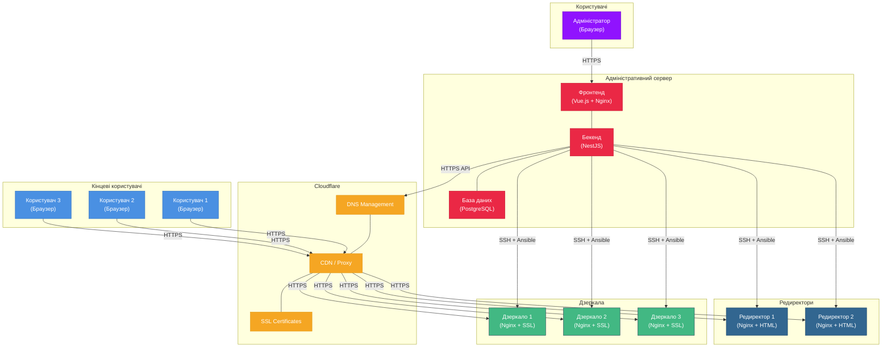

# Діаграма інфраструктури RokoCDN

Ця діаграма відображає фізичні компоненти системи RokoCDN та їх взаємодію.

## Інфраструктура системи

## Опис компонентів інфраструктури

### Адміністративний сервер
- **Фронтенд (Vue.js + Nginx)**: Веб-інтерфейс для управління системою
- **Бекенд (NestJS)**: API-сервер для обробки запитів від фронтенду
- **База даних (PostgreSQL)**: Зберігання всіх даних системи

### Cloudflare
- **DNS Management**: Управління DNS-записами для доменів
- **CDN / Proxy**: Кешування та проксіювання запитів до дзеркал та редиректорів
- **SSL Certificates**: Управління SSL-сертифікатами для доменів

### Дзеркала
- **Дзеркало 1, 2, 3**: Сервери з Nginx, які містять копії контенту оригінального сайту

### Редиректори
- **Редиректор 1, 2**: Сервери з Nginx, які перенаправляють користувачів на інші сайти

### Користувачі
- **Адміністратор**: Управляє системою через веб-інтерфейс
- **Кінцеві користувачі**: Отримують доступ до контенту через дзеркала або перенаправляються через редиректори

## Потоки даних в інфраструктурі

### Адміністрування системи
1. Адміністратор взаємодіє з фронтендом через HTTPS
2. Фронтенд взаємодіє з бекендом через локальний зв'язок
3. Бекенд зберігає та отримує дані з бази даних

### Розгортання та налаштування
1. Бекенд взаємодіє з Cloudflare API для управління DNS-записами
2. Бекенд використовує SSH та Ansible для розгортання та налаштування дзеркал та редиректорів

### Доступ кінцевих користувачів
1. Користувачі звертаються до доменів через HTTPS
2. Запити проходять через Cloudflare CDN/Proxy
3. Cloudflare перенаправляє запити до відповідних дзеркал або редиректорів
4. Дзеркала повертають контент, а редиректори перенаправляють користувачів на інші сайти