# Діаграма варіантів використання RokoCDN

Ця діаграма відображає основні функції системи RokoCDN з точки зору користувача.

## Варіанти використання

```mermaid
flowchart TB
    subgraph "Актори"
        Admin["Адміністратор"]
        EndUser["Кінцевий користувач"]
    end

    subgraph "Управління користувачами"
        UC1["Реєстрація"]
        UC2["Авторизація"]
        UC3["Управління профілем"]
    end

    subgraph "Управління проектами"
        UC4["Створення проекту"]
        UC5["Перегляд проектів"]
        UC6["Редагування проекту"]
        UC7["Видалення проекту"]
    end

    subgraph "Управління серверами"
        UC8["Додавання сервера"]
        UC9["Перегляд серверів"]
        UC10["Редагування сервера"]
        UC11["Видалення сервера"]
        UC12["Перевірка доступності сервера"]
    end

    subgraph "Управління доменами"
        UC13["Додавання домену"]
        UC14["Перегляд доменів"]
        UC15["Редагування домену"]
        UC16["Видалення домену"]
    end

    subgraph "Управління DNS-записами"
        UC17["Створення DNS-запису"]
        UC18["Перегляд DNS-записів"]
        UC19["Редагування DNS-запису"]
        UC20["Видалення DNS-запису"]
        UC21["Синхронізація з Cloudflare"]
    end

    subgraph "Управління конфігураціями"
        UC22["Створення конфігурації"]
        UC23["Перегляд конфігурацій"]
        UC24["Редагування конфігурації"]
        UC25["Видалення конфігурації"]
    end

    subgraph "Управління розгортанням"
        UC26["Створення завдання розгортання"]
        UC27["Перегляд завдань розгортання"]
        UC28["Повторне виконання завдання"]
        UC29["Скасування завдання"]
    end

    subgraph "Управління редиректорами"
        UC30["Створення редиректора"]
        UC31["Перегляд редиректорів"]
        UC32["Редагування редиректора"]
        UC33["Видалення редиректора"]
    end

    subgraph "Моніторинг та логування"
        UC34["Перегляд журналу подій"]
        UC35["Перевірка стану дзеркал"]
        UC36["Перевірка стану редиректорів"]
        UC37["Експорт логів"]
    end

    subgraph "Використання дзеркал та редиректорів"
        UC38["Доступ до контенту через дзеркало"]
        UC39["Перенаправлення через редиректор"]
    end

    %% Зв'язки між акторами та варіантами використання
    Admin --> UC1
    Admin --> UC2
    Admin --> UC3
    Admin --> UC4
    Admin --> UC5
    Admin --> UC6
    Admin --> UC7
    Admin --> UC8
    Admin --> UC9
    Admin --> UC10
    Admin --> UC11
    Admin --> UC12
    Admin --> UC13
    Admin --> UC14
    Admin --> UC15
    Admin --> UC16
    Admin --> UC17
    Admin --> UC18
    Admin --> UC19
    Admin --> UC20
    Admin --> UC21
    Admin --> UC22
    Admin --> UC23
    Admin --> UC24
    Admin --> UC25
    Admin --> UC26
    Admin --> UC27
    Admin --> UC28
    Admin --> UC29
    Admin --> UC30
    Admin --> UC31
    Admin --> UC32
    Admin --> UC33
    Admin --> UC34
    Admin --> UC35
    Admin --> UC36
    Admin --> UC37
    
    EndUser --> UC38
    EndUser --> UC39
    
    %% Стилі для різних груп компонентів
    classDef actor fill:#9013fe,stroke:#7311c7,color:white;
    classDef usecase fill:#42b883,stroke:#35495e,color:white;

    class Admin,EndUser actor;
    class UC1,UC2,UC3,UC4,UC5,UC6,UC7,UC8,UC9,UC10,UC11,UC12,UC13,UC14,UC15,UC16,UC17,UC18,UC19,UC20,UC21,UC22,UC23,UC24,UC25,UC26,UC27,UC28,UC29,UC30,UC31,UC32,UC33,UC34,UC35,UC36,UC37,UC38,UC39 usecase;
```

## Опис варіантів використання

### Управління користувачами
- **Реєстрація**: Створення нового облікового запису адміністратора
- **Авторизація**: Вхід в систему з використанням облікових даних
- **Управління профілем**: Зміна особистих даних та налаштувань

### Управління проектами
- **Створення проекту**: Додавання нового проекту в систему
- **Перегляд проектів**: Перегляд списку всіх проектів
- **Редагування проекту**: Зміна параметрів існуючого проекту
- **Видалення проекту**: Видалення проекту з системи

### Управління серверами
- **Додавання сервера**: Реєстрація нового сервера в системі
- **Перегляд серверів**: Перегляд списку всіх серверів
- **Редагування сервера**: Зміна параметрів існуючого сервера
- **Видалення сервера**: Видалення сервера з системи
- **Перевірка доступності сервера**: Перевірка, чи доступний сервер

### Управління доменами
- **Додавання домену**: Реєстрація нового домену в системі
- **Перегляд доменів**: Перегляд списку всіх доменів
- **Редагування домену**: Зміна параметрів існуючого домену
- **Видалення домену**: Видалення домену з системи

### Управління DNS-записами
- **Створення DNS-запису**: Додавання нового DNS-запису
- **Перегляд DNS-записів**: Перегляд списку всіх DNS-записів
- **Редагування DNS-запису**: Зміна параметрів існуючого DNS-запису
- **Видалення DNS-запису**: Видалення DNS-запису з системи
- **Синхронізація з Cloudflare**: Синхронізація DNS-записів з Cloudflare

### Управління конфігураціями
- **Створення конфігурації**: Додавання нової конфігурації Nginx
- **Перегляд конфігурацій**: Перегляд списку всіх конфігурацій
- **Редагування конфігурації**: Зміна параметрів існуючої конфігурації
- **Видалення конфігурації**: Видалення конфігурації з системи

### Управління розгортанням
- **Створення завдання розгортання**: Ініціювання нового розгортання
- **Перегляд завдань розгортання**: Перегляд списку всіх завдань розгортання
- **Повторне виконання завдання**: Повторний запуск завдання, яке завершилося з помилкою
- **Скасування завдання**: Скасування завдання, яке очікує виконання

### Управління редиректорами
- **Створення редиректора**: Додавання нового редиректора
- **Перегляд редиректорів**: Перегляд списку всіх редиректорів
- **Редагування редиректора**: Зміна параметрів існуючого редиректора
- **Видалення редиректора**: Видалення редиректора з системи

### Моніторинг та логування
- **Перегляд журналу подій**: Перегляд історії дій в системі
- **Перевірка стану дзеркал**: Перевірка доступності та працездатності дзеркал
- **Перевірка стану редиректорів**: Перевірка доступності та працездатності редиректорів
- **Експорт логів**: Експорт журналу подій у файл

### Використання дзеркал та редиректорів
- **Доступ до контенту через дзеркало**: Отримання контенту через дзеркало
- **Перенаправлення через редиректор**: Перенаправлення на інший сайт через редиректор