# Діаграма компонентів RokoCDN

Ця діаграма відображає структуру модулів та компонентів системи RokoCDN.

## Компоненти системи

```mermaid
flowchart TB
    subgraph "Фронтенд (Vue.js)"
        VueApp["Vue App"]
        
        subgraph "Компоненти"
            AuthComponents["Auth Components"]
            ProjectComponents["Project Components"]
            ServerComponents["Server Components"]
            DomainComponents["Domain Components"]
            DnsRecordComponents["DNS Record Components"]
            ConfigComponents["Config Components"]
            DeployJobComponents["Deploy Job Components"]
            RedirectorComponents["Redirector Components"]
            LogComponents["Log Components"]
            TagComponents["Tag Components"]
        end
        
        subgraph "Сервіси"
            ApiService["API Service"]
            AuthService["Auth Service"]
            StoreService["Store Service"]
        end
        
        subgraph "Маршрутизація"
            Router["Vue Router"]
            Guards["Route Guards"]
        end
        
        VueApp --> AuthComponents
        VueApp --> ProjectComponents
        VueApp --> ServerComponents
        VueApp --> DomainComponents
        VueApp --> DnsRecordComponents
        VueApp --> ConfigComponents
        VueApp --> DeployJobComponents
        VueApp --> RedirectorComponents
        VueApp --> LogComponents
        VueApp --> TagComponents
        
        AuthComponents --> AuthService
        ProjectComponents --> ApiService
        ServerComponents --> ApiService
        DomainComponents --> ApiService
        DnsRecordComponents --> ApiService
        ConfigComponents --> ApiService
        DeployJobComponents --> ApiService
        RedirectorComponents --> ApiService
        LogComponents --> ApiService
        TagComponents --> ApiService
        
        ApiService --> StoreService
        AuthService --> StoreService
        
        VueApp --> Router
        Router --> Guards
        Guards --> AuthService
    end
    
    subgraph "Бекенд (NestJS)"
        NestApp["NestJS App"]
        
        subgraph "Модулі"
            AuthModule["Auth Module"]
            ProjectsModule["Projects Module"]
            ServersModule["Servers Module"]
            DomainsModule["Domains Module"]
            DnsRecordsModule["DNS Records Module"]
            ConfigsModule["Configs Module"]
            DeployJobsModule["Deploy Jobs Module"]
            RedirectorsModule["Redirectors Module"]
            LogsModule["Logs Module"]
            TagsModule["Tags Module"]
            AnsibleModule["Ansible Module"]
            CloudflareModule["Cloudflare Module"]
        end
        
        subgraph "Контролери"
            AuthController["Auth Controller"]
            ProjectsController["Projects Controller"]
            ServersController["Servers Controller"]
            DomainsController["Domains Controller"]
            DnsRecordsController["DNS Records Controller"]
            ConfigsController["Configs Controller"]
            DeployJobsController["Deploy Jobs Controller"]
            RedirectorsController["Redirectors Controller"]
            LogsController["Logs Controller"]
            TagsController["Tags Controller"]
        end
        
        subgraph "Сервіси"
            AuthServiceBE["Auth Service"]
            ProjectsService["Projects Service"]
            ServersService["Servers Service"]
            DomainsService["Domains Service"]
            DnsRecordsService["DNS Records Service"]
            ConfigsService["Configs Service"]
            DeployJobsService["Deploy Jobs Service"]
            RedirectorsService["Redirectors Service"]
            LogsService["Logs Service"]
            TagsService["Tags Service"]
            AnsibleExecutorService["Ansible Executor Service"]
            CloudflareService["Cloudflare Service"]
        end
        
        subgraph "Сутності"
            UserEntity["User Entity"]
            ProjectEntity["Project Entity"]
            ServerEntity["Server Entity"]
            DomainEntity["Domain Entity"]
            DnsRecordEntity["DNS Record Entity"]
            ConfigEntity["Config Entity"]
            DeployJobEntity["Deploy Job Entity"]
            RedirectorEntity["Redirector Entity"]
            LogEntity["Log Entity"]
            TagEntity["Tag Entity"]
        end
        
        NestApp --> AuthModule
        NestApp --> ProjectsModule
        NestApp --> ServersModule
        NestApp --> DomainsModule
        NestApp --> DnsRecordsModule
        NestApp --> ConfigsModule
        NestApp --> DeployJobsModule
        NestApp --> RedirectorsModule
        NestApp --> LogsModule
        NestApp --> TagsModule
        NestApp --> AnsibleModule
        NestApp --> CloudflareModule
        
        AuthModule --> AuthController
        ProjectsModule --> ProjectsController
        ServersModule --> ServersController
        DomainsModule --> DomainsController
        DnsRecordsModule --> DnsRecordsController
        ConfigsModule --> ConfigsController
        DeployJobsModule --> DeployJobsController
        RedirectorsModule --> RedirectorsController
        LogsModule --> LogsController
        TagsModule --> TagsController
        
        AuthController --> AuthServiceBE
        ProjectsController --> ProjectsService
        ServersController --> ServersService
        DomainsController --> DomainsService
        DnsRecordsController --> DnsRecordsService
        ConfigsController --> ConfigsService
        DeployJobsController --> DeployJobsService
        RedirectorsController --> RedirectorsService
        LogsController --> LogsService
        TagsController --> TagsService
        
        AuthServiceBE --> UserEntity
        ProjectsService --> ProjectEntity
        ServersService --> ServerEntity
        DomainsService --> DomainEntity
        DnsRecordsService --> DnsRecordEntity
        ConfigsService --> ConfigEntity
        DeployJobsService --> DeployJobEntity
        RedirectorsService --> RedirectorEntity
        LogsService --> LogEntity
        TagsService --> TagEntity
        
        DeployJobsService --> AnsibleExecutorService
        DomainsService --> CloudflareService
        DnsRecordsService --> CloudflareService
        
        AnsibleModule --> AnsibleExecutorService
        CloudflareModule --> CloudflareService
    end
    
    subgraph "Зовнішні інтеграції"
        Cloudflare["Cloudflare API"]
        Ansible["Ansible"]
        VPS["VPS Servers"]
    end
    
    ApiService --> NestApp
    CloudflareService --> Cloudflare
    AnsibleExecutorService --> Ansible
    Ansible --> VPS
    
    %% Стилі для різних груп компонентів
    classDef frontend fill:#42b883,stroke:#35495e,color:white;
    classDef backend fill:#ea2845,stroke:#c5162e,color:white;
    classDef external fill:#f5a623,stroke:#e09612,color:white;

    class VueApp,AuthComponents,ProjectComponents,ServerComponents,DomainComponents,DnsRecordComponents,ConfigComponents,DeployJobComponents,RedirectorComponents,LogComponents,TagComponents,ApiService,AuthService,StoreService,Router,Guards frontend;
    class NestApp,AuthModule,ProjectsModule,ServersModule,DomainsModule,DnsRecordsModule,ConfigsModule,DeployJobsModule,RedirectorsModule,LogsModule,TagsModule,AnsibleModule,CloudflareModule,AuthController,ProjectsController,ServersController,DomainsController,DnsRecordsController,ConfigsController,DeployJobsController,RedirectorsController,LogsController,TagsController,AuthServiceBE,ProjectsService,ServersService,DomainsService,DnsRecordsService,ConfigsService,DeployJobsService,RedirectorsService,LogsService,TagsService,AnsibleExecutorService,CloudflareService,UserEntity,ProjectEntity,ServerEntity,DomainEntity,DnsRecordEntity,ConfigEntity,DeployJobEntity,RedirectorEntity,LogEntity,TagEntity backend;
    class Cloudflare,Ansible,VPS external;
```

## Опис компонентів

### Фронтенд (Vue.js)
- **Vue App**: Головний компонент додатку
- **Компоненти**: Компоненти для різних сутностей системи (Auth, Project, Server, Domain, DNS Record, Config, Deploy Job, Redirector, Log, Tag)
- **Сервіси**: Сервіси для взаємодії з бекендом та управління станом додатку
- **Маршрутизація**: Компоненти для маршрутизації між сторінками

### Бекенд (NestJS)
- **NestJS App**: Головний компонент додатку
- **Модулі**: Модулі для різних сутностей системи (Auth, Projects, Servers, Domains, DNS Records, Configs, Deploy Jobs, Redirectors, Logs, Tags, Ansible, Cloudflare)
- **Контролери**: Контролери для обробки HTTP-запитів
- **Сервіси**: Сервіси для реалізації бізнес-логіки
- **Сутності**: Сутності для взаємодії з базою даних

### Зовнішні інтеграції
- **Cloudflare API**: API для управління DNS-записами
- **Ansible**: Інструмент для автоматизації розгортання
- **VPS Servers**: Віртуальні сервери для розгортання дзеркал та редиректорів

## Взаємодія компонентів

### Фронтенд
1. Vue App ініціалізує компоненти та маршрутизацію
2. Компоненти використовують сервіси для взаємодії з бекендом
3. ApiService відправляє HTTP-запити до бекенду
4. AuthService управляє авторизацією користувача
5. StoreService зберігає стан додатку
6. Router управляє маршрутизацією між сторінками
7. Guards перевіряють права доступу до сторінок

### Бекенд
1. NestJS App ініціалізує модулі
2. Модулі ініціалізують контролери та сервіси
3. Контролери обробляють HTTP-запити та викликають методи сервісів
4. Сервіси реалізують бізнес-логіку та взаємодіють з сутностями
5. Сутності взаємодіють з базою даних
6. AnsibleExecutorService взаємодіє з Ansible для розгортання на серверах
7. CloudflareService взаємодіє з Cloudflare API для управління DNS-записами

### Зовнішні інтеграції
1. CloudflareService відправляє HTTP-запити до Cloudflare API
2. AnsibleExecutorService викликає Ansible для розгортання на серверах
3. Ansible виконує SSH-команди на VPS-серверах