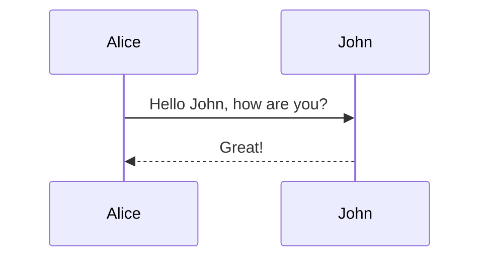

# Діаграми RokoCDN

Цей каталог містить набір діаграм Mermaid, які відображають різні аспекти архітектури та функціональності системи RokoCDN.

## Зміст

1. [Архітектурна діаграма](01-architecture.md) - загальна архітектура системи
2. [ER-діаграма](02-entity-relationship.md) - модель даних та зв'язки між сутностями
3. [Діаграма послідовності розгортання](03-sequence-deploy.md) - процес створення та розгортання домену
4. [Діаграма станів завдання розгортання](04-state-deploy-job.md) - життєвий цикл завдання розгортання
5. [Діаграма потоків даних](05-data-flow.md) - потоки даних між компонентами системи
6. [Діаграма інфраструктури](06-infrastructure.md) - фізичні компоненти системи та їх взаємодія
7. [Діаграма варіантів використання](07-use-case.md) - основні функції системи з точки зору користувача
8. [Діаграма компонентів](08-component.md) - структура модулів та компонентів системи

## Про Mermaid

[Mermaid](https://mermaid-js.github.io/mermaid/) - це інструмент для створення діаграм та графіків на основі тексту. Він дозволяє створювати діаграми безпосередньо в Markdown-файлах, що спрощує їх підтримку та версіонування.

### Перегляд діаграм

Для перегляду діаграм Mermaid можна використовувати:

1. **GitHub** - GitHub підтримує рендеринг діаграм Mermaid безпосередньо в Markdown-файлах.
2. **VS Code** - Розширення [Markdown Preview Mermaid Support](https://marketplace.visualstudio.com/items?itemName=bierner.markdown-mermaid) дозволяє переглядати діаграми Mermaid в режимі попереднього перегляду Markdown.
3. **Mermaid Live Editor** - [Онлайн-редактор](https://mermaid.live/), який дозволяє створювати та редагувати діаграми Mermaid.

### Редагування діаграм

Для редагування діаграм Mermaid можна використовувати будь-який текстовий редактор. Синтаксис Mermaid простий та інтуїтивно зрозумілий.

Приклад синтаксису для діаграми послідовності:

## Використання діаграм

Діаграми в цьому каталозі можна використовувати для:

1. **Документування системи** - діаграми допомагають зрозуміти архітектуру та функціональність системи.
2. **Планування розробки** - діаграми можуть бути використані для планування нових функцій та змін в системі.
3. **Навчання нових розробників** - діаграми допомагають новим розробникам швидше зрозуміти систему.
4. **Комунікація з зацікавленими сторонами** - діаграми спрощують комунікацію з зацікавленими сторонами, які не є технічними спеціалістами.

## Оновлення діаграм

При внесенні змін в систему, важливо також оновлювати відповідні діаграми, щоб вони відображали актуальний стан системи. Це допоможе підтримувати документацію в актуальному стані та спростить розуміння системи для всіх учасників проекту.