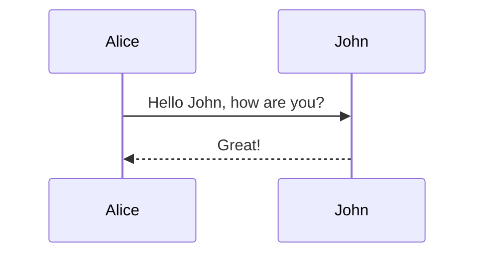

# RokoCDN Diagrams

This directory contains a set of Mermaid diagrams that represent various aspects of the architecture and functionality of the RokoCDN system.

## Contents

1. [Architecture Diagram](01-architecture.md) - overall system architecture
2. [ER Diagram](02-entity-relationship.md) - data model and relationships between entities
3. [Deployment Sequence Diagram](03-sequence-deploy.md) - domain creation and deployment process
4. [Deploy Job State Diagram](04-state-deploy-job.md) - deployment job lifecycle
5. [Data Flow Diagram](05-data-flow.md) - data flows between system components
6. [Infrastructure Diagram](06-infrastructure.md) - physical components of the system and their interaction
7. [Use Case Diagram](07-use-case.md) - main system functions from the user's perspective
8. [Component Diagram](08-component.md) - structure of modules and components of the system

## About Mermaid

[Mermaid](https://mermaid-js.github.io/mermaid/) is a tool for creating diagrams and charts based on text. It allows you to create diagrams directly in Markdown files, which simplifies their maintenance and versioning.

### Viewing Diagrams

To view Mermaid diagrams, you can use:

1. **GitHub** - GitHub supports rendering Mermaid diagrams directly in Markdown files.
2. **VS Code** - The [Markdown Preview Mermaid Support](https://marketplace.visualstudio.com/items?itemName=bierner.markdown-mermaid) extension allows you to view Mermaid diagrams in Markdown preview mode.
3. **Mermaid Live Editor** - An [online editor](https://mermaid.live/) that allows you to create and edit Mermaid diagrams.

### Editing Diagrams

To edit Mermaid diagrams, you can use any text editor. The Mermaid syntax is simple and intuitive.

Example syntax for a sequence diagram:

## Using Diagrams

The diagrams in this directory can be used for:

1. **System Documentation** - diagrams help understand the architecture and functionality of the system.
2. **Development Planning** - diagrams can be used to plan new features and changes to the system.
3. **Training New Developers** - diagrams help new developers understand the system faster.
4. **Communication with Stakeholders** - diagrams simplify communication with stakeholders who are not technical specialists.

## Updating Diagrams

When making changes to the system, it is also important to update the corresponding diagrams to reflect the current state of the system. This will help keep the documentation up to date and simplify understanding of the system for all project participants.