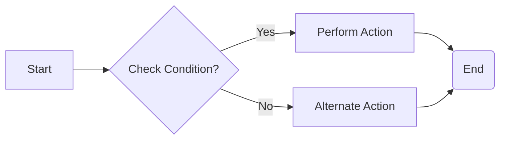
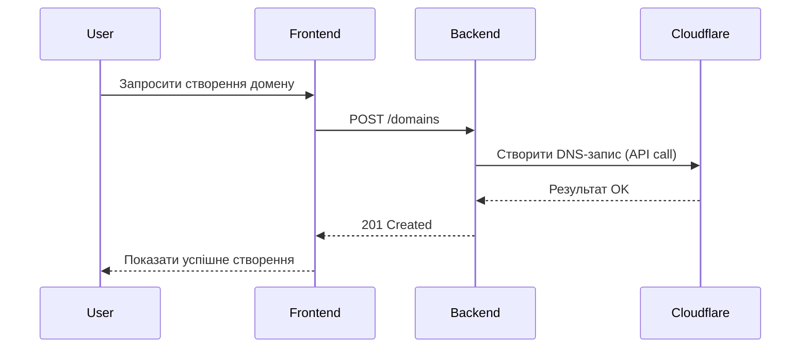
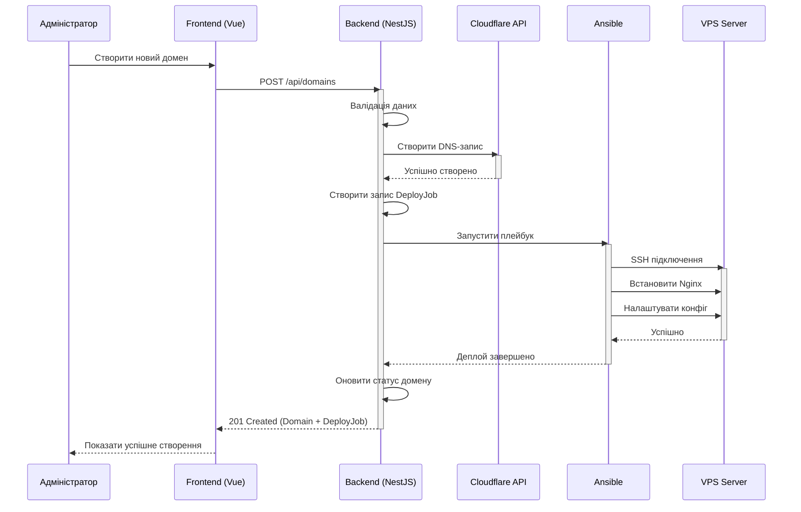

# Діаграми Mermaid для проекту RokoCDN

Цей документ містить детальний огляд основних типів діаграм, які підтримує Mermaid, а також рекомендації з їх використання для проєкту RokoCDN. Окрім огляду синтаксису та ключових опцій, показано приклади коду, які можна інтегрувати у документацію проекту.

## Зміст
1. [Flowchart (блок-схема)](#1-flowchart-блок-схема)
2. [Sequence Diagram (діаграма послідовності)](#2-sequence-diagram-діаграма-послідовності)
3. [Class Diagram (діаграма класів)](#3-class-diagram-діаграма-класів)
4. [State Diagram (діаграма станів)](#4-state-diagram-діаграма-станів)
5. [ER Diagram (діаграма сутність-зв'язок)](#5-er-diagram-діаграма-сутність-звязок)
6. [Gantt Diagram (діаграма Ганта)](#6-gantt-diagram-діаграма-ганта)
7. [Pie Chart (кругова діаграма)](#7-pie-chart-кругова-діаграма)
8. [User Journey Diagram (діаграма шляху користувача)](#8-user-journey-diagram-діаграма-шляху-користувача)
9. [Можливості налаштування Mermaid](#можливості-налаштування-mermaid)
10. [Інтеграція з інструментами документування](#інтеграція-з-інструментами-документування)
11. [Практичні кейси для RokoCDN](#практичні-кейси-для-rokocdn)

---

## 1. Flowchart (блок-схема)
**Призначення**: візуальне відображення послідовності дій, логіки або процесу у вигляді блок-схеми.  
**Оптимальні сценарії**:  
- опис workflow, де є конкретні кроки та гілки рішень (розгалуження «так/ні»);  
- представлення алгоритмів, e2e-процесів (наприклад, у RokoCDN – процес створення нового домену з Cloudflare DNS, деплоймент на сервері, тощо).

**Синтаксис**  

- `flowchart LR` задає напрямок (зліва направо). Варіанти: `LR`, `TB` (top-bottom), `RL`, `BT` тощо.  
- Вузли (A, B, C, D, E) мають різні стилі:  
  - `[text]` – прямокутник зі скругленням,  
  - `{text}` – ромб (умовний крок),  
  - `(text)` – коло,  
  - `((text))` – заокруглений блок.  
- Стрілки – `-->` або `-- текст -->` (для підписаних стрілок).  

**Приклад для RokoCDN**:  
```mermaid
flowchart TD
    A[Початок] --> B[Отримати дані домену]
    B --> C{Домен існує?}
    C -- Так --> D[Помилка: домен вже існує]
    C -- Ні --> E[Створити DNS-запис в Cloudflare]
    E --> F{DNS створено успішно?}
    F -- Так --> G[Запустити Ansible-плейбук]
    F -- Ні --> H[Помилка: не вдалося створити DNS]
    G --> I{Деплой успішний?}
    I -- Так --> J[Оновити статус домену на "активний"]
    I -- Ні --> K[Оновити статус домену на "помилка"]
    J --> L[Кінець]
    K --> L[Кінець]
    H --> L[Кінець]
    D --> L[Кінець]
```

---

## 2. Sequence Diagram (діаграма послідовності)
**Призначення**: опис хронології обміну повідомленнями між учасниками системи (зокрема, мікросервісами, клієнтом і сервером, зовнішніми API).  
**Оптимальні сценарії**:  
- показати, як фронтенд RokoCDN викликає бекенд, той звертається до Cloudflare, повертає результат і т.д.;  
- узаємодія між NestJS та Ansible у процесі деплою;  
- аутентифікація користувача (логін з отриманням JWT).

**Синтаксис**  

- `participant X` – назва учасника (приміром, Client, Server, DB, Cloudflare).  
- `->>` позначає синхронний виклик, `->` – асинхронний.  
- Можна додавати `activate`/`deactivate` для показу періодів активності.  

**Приклад для RokoCDN**:  


---

## 3. Class Diagram (діаграма класів)
**Призначення**: відобразити структуру класів, їх поля, методи і відносини (наслідування, асоціації) – зазвичай релевантно до ООП. У Mermaid також можна будувати схожий граф сутностей (ERD).  
**Оптимальні сценарії**:  
- Показати сутності TypeORM (Domain, Server, Project) і їхні поля + зв'язки.  
