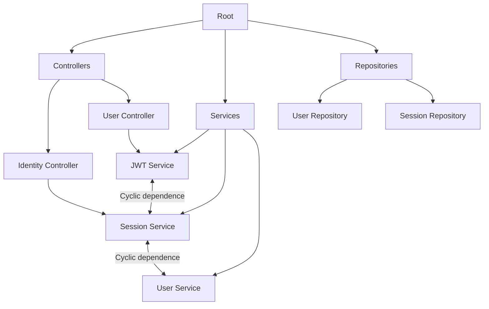
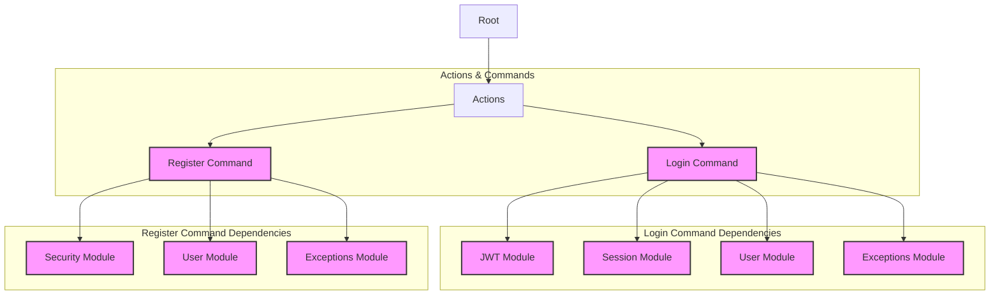
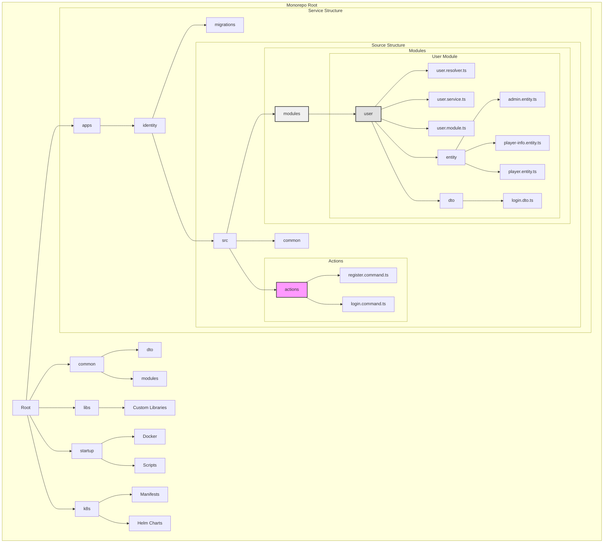
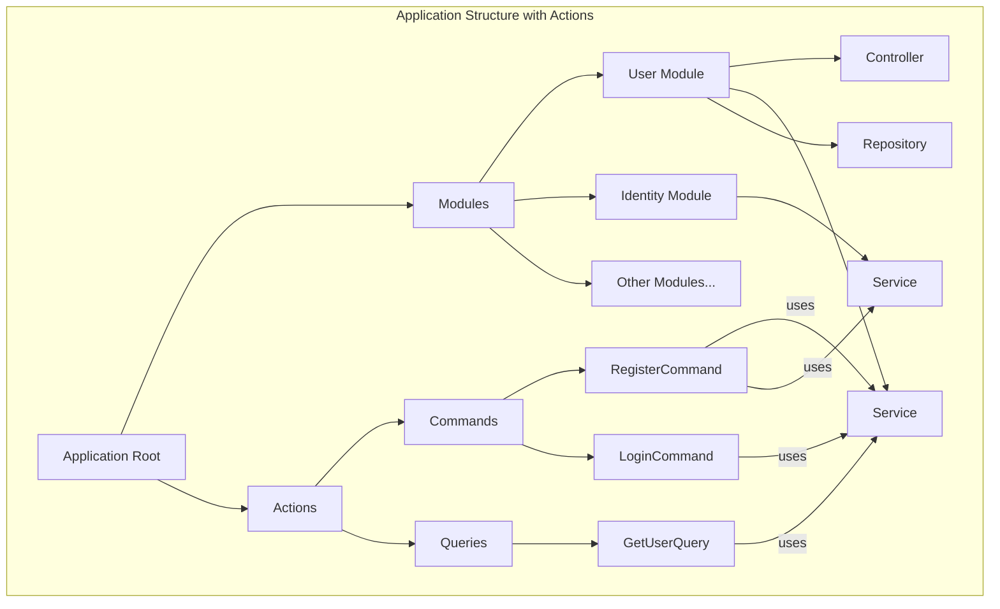

# NestJS Modular Architecture Documentation

## Overview

This document describes a modernized approach to NestJS application architecture, emphasizing modularity and clear separation of concerns. The architecture is designed for a monorepo structure, allowing multiple services to share common code while maintaining clear boundaries.

## Traditional vs. Modular Approach

### Traditional Approach



### Modular Approach - Modules Structure

```mermaid
graph TB
    classDef moduleNode fill:#f0f0f0,stroke:#333,stroke-width:2px

    Root[Root] --> Modules

    %% Core Modules
    subgraph "Core Modules"
        direction TB
        JM[JWT Module]:::moduleNode
        SM[Security Module]:::moduleNode
        SEM[Session Module]:::moduleNode
        UM[User Module]:::moduleNode
        EM[Exceptions Module]:::moduleNode
    end

    %% JWT Module Structure
    JM --> JMR[JWT Resolver]
    JM --> JMS[JWT Service]
    JM --> JME[JWT Entities]

    %% Security Module Structure
    SM --> SMR[Security Resolver]
    SM --> SMS[Security Service]
    SM --> SME[Security Entities]

    %% Session Module Structure
    SEM --> SEMR[Session Resolver]
    SEM --> SEMS[Session Service]
    SEM --> SEME[Session Entities]

    %% User Module Structure
    UM --> UMR[User Resolver]
    UM --> UMS[User Service]
    UM --> UME[User Entities]
```



### Modular Approach - Actions Structure



### Traditional Approach

In traditional NestJS applications, code is organized by technical types:

- `/controllers` - All controllers across the application
- `/services` - All services
- `/repositories` - All repositories

Drawbacks:

- Poor navigation in large applications
- Difficult to understand feature boundaries
- High coupling between different features
- Challenging to maintain as the application grows

### Modular Approach

Our architecture organizes code by business domains:

- Each module is self-contained
- Contains its own controllers, services, and repositories
- Clear feature boundaries
- Easier navigation and maintenance
- Better scalability

Benefits:

- Improved code organization
- Clear feature boundaries
- Easier to add new features
- Better code reusability
- Reduced coupling between features

## Monorepo Structure

### Structure Overview



### Root Level

- `/apps` - All microservices
- `/common` - Shared code and modules
- `/libs` - Custom libraries
- `/startup` - Deployment and utility scripts
- `/k8s` - Kubernetes configurations

### Common Directory

- `/dto` - Shared DTOs
- `/modules` - Shared modules (logging, caching, etc.)

### Service Structure (in /apps)

Each service follows a consistent structure:

- `/migrations` - Database migrations
- `/src`
  - `/actions` - Business logic orchestration
  - `/common` - Service-specific shared code
  - `/modules` - Business domain modules

### Module Structure

Example for User module (`/apps/identity/modules/user`):

```
user/
├── user.resolver.ts
├── user.service.ts
├── user.module.ts
├── entity/
│   ├── admin.entity.ts
│   ├── player-info.entity.ts
│   └── player.entity.ts
└── dto/
    └── login.dto.ts
```

## Actions Pattern

### Architectural Overview with Actions



Actions are introduced to handle complex business operations that span multiple modules while avoiding circular dependencies.

### Purpose

- Orchestrate complex operations
- Prevent circular dependencies
- Separate complex business logic from modules
- Maintain single responsibility principle

### Implementation

Actions use CQRS pattern with Commands and Queries:

Example Commands:

1. `register.command.ts`
2. `login.command.ts`

These commands can use multiple services:

- TokenService
- UserService
- PasswordService
- SessionService
- ExceptionService

Benefits:

- Clear separation of concerns
- Avoid service pollution with complex logic
- Better testability
- Improved maintainability

## Best Practices

1. Module Independence

   - Each module should be self-contained
   - Minimal dependencies between modules
   - Clear interface definitions

2. Action Pattern Usage

   - Use actions for complex operations
   - Keep module services focused on their domain
   - Implement CQRS pattern for better separation

3. Shared Code Management

   - Use common directory for truly shared code
   - Avoid circular dependencies
   - Keep shared code minimal and generic

4. Testing
   - Each module can be tested independently
   - Actions provide clear boundaries for integration tests
   - Easier to mock dependencies
