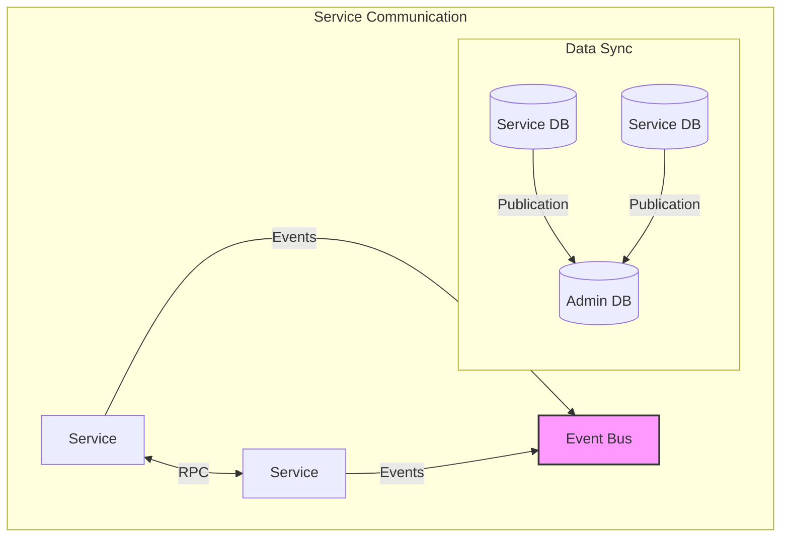
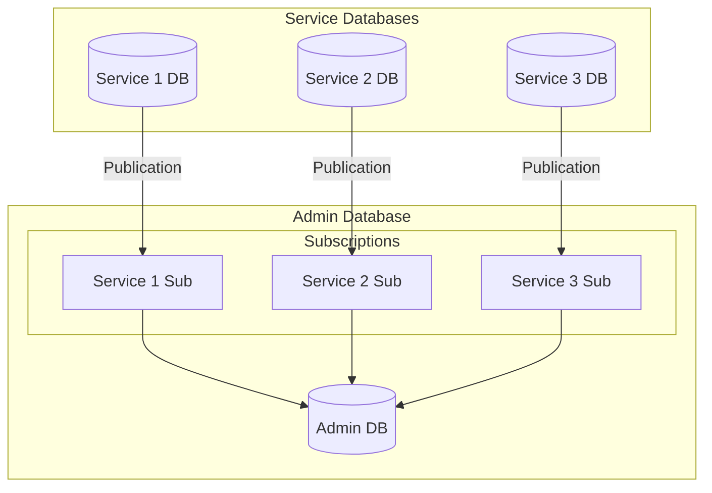
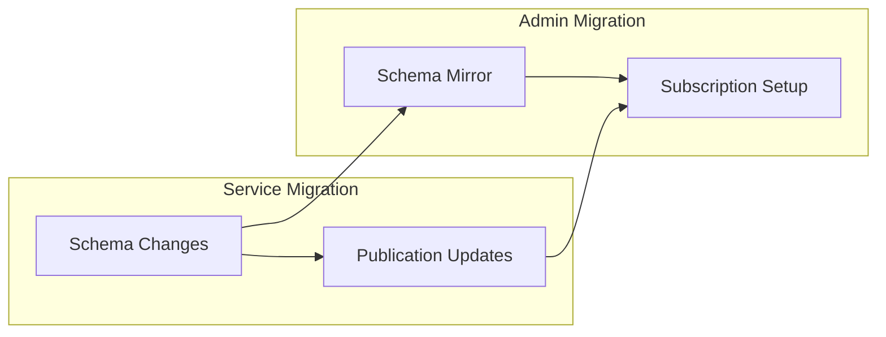

# Database and Architecture Guide

## Architecture Overview

### Microservices Communication Patterns



#### Core Communication Methods

1. **Event-Based Communication**

   - Asynchronous state updates between services
   - Guaranteed message delivery
   - Supports multiple subscribers
   - Used for: notifications, state changes, async processes

2. **RPC (Remote Procedure Call)**

   - Synchronous request-response pattern
   - Direct service-to-service communication
   - Used for: immediate responses, transactional operations

3. **Logical Replication**
   - Asynchronous data synchronization
   - One-way flow from service databases to admin
   - Maintains data consistency across system
   - Used for: reporting, analytics, admin operations

## Database Management Guide

### Migration Management

#### Structure

```
/apps
  /service-name
    /migrations
      - YYYYMMDDHHMMSS-description.ts
  /admin
    /migrations
      /service-name
        - YYYYMMDDHHMMSS-description.ts
```

#### Adding New Migrations

1. **Service Database Migrations**

   ```typescript
   export class ServiceMigration implements MigrationInterface {
     public async up(queryRunner: QueryRunner): Promise<void> {
       // Schema changes
       await queryRunner.query(/* sql */ `
         CREATE TABLE example (
           id SERIAL PRIMARY KEY,
           data JSONB
         );
       `);
     }

     public async down(queryRunner: QueryRunner): Promise<void> {
       await queryRunner.query(/* sql */ `DROP TABLE example;`);
     }
   }
   ```

2. **Publication Setup**

   ```typescript
   export class CreatePublication implements MigrationInterface {
     public async up(queryRunner: QueryRunner): Promise<void> {
       // Grant permissions
       await queryRunner.query(/* sql */ `
         GRANT SELECT ON ALL TABLES IN SCHEMA public TO ${replicatorUser};
       `);

       // Create publication
       await queryRunner.query(/* sql */ `
         CREATE PUBLICATION service_publication
         FOR TABLE table1, table2;
       `);
     }
   }
   ```

3. **Admin Database Subscription**
   ```typescript
   export class CreateSubscription implements MigrationInterface {
     public async up(queryRunner: QueryRunner): Promise<void> {
       await queryRunner.query(/* sql */ `
         CREATE SUBSCRIPTION service_subscription
         CONNECTION 'dbname=service host=${host} user=${user} password=${pass}'
         PUBLICATION service_publication;
       `);
     }
   }
   ```

### Logical Replication Setup

#### Publication Management

1. **Create Publication**

   - Define tables to replicate
   - Grant necessary permissions
   - Create publication for specified tables

2. **Subscription Setup**
   - Create subscription in admin database
   - Connect to service database
   - Subscribe to service publication

#### Best Practices

1. **Migration Organization**

   - Keep service migrations separate
   - Mirror service migrations in admin
   - Use timestamp-based naming

2. **Replication Management**
   - One publication per service
   - Consistent naming patterns
   - Clear permission management

## Database Architecture

### System Database Design



### Key Components

1. **Service Databases**

   - Independent schema management
   - Local migrations
   - Publication configuration
   - Data ownership

2. **Admin Database**

   - Consolidated data store
   - Subscription management
   - Read-only replicated data
   - Cross-service reporting

3. **Replication Flow**
   - One-way data flow
   - Service → Admin direction
   - Asynchronous updates
   - Eventual consistency

### Migration Management Approach



### Best Practices

1. **Database Independence**

   - Services own their data
   - Independent schema evolution
   - Controlled data sharing

2. **Replication Management**

   - Clear publication scope
   - Proper permission setup
   - Monitored replication lag

3. **Migration Coordination**
   - Synchronized deployments
   - Version tracking
   - Rollback planning
