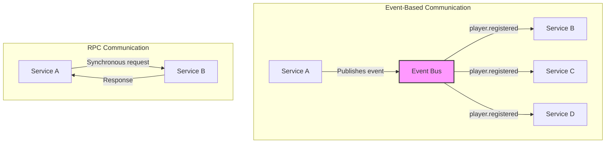
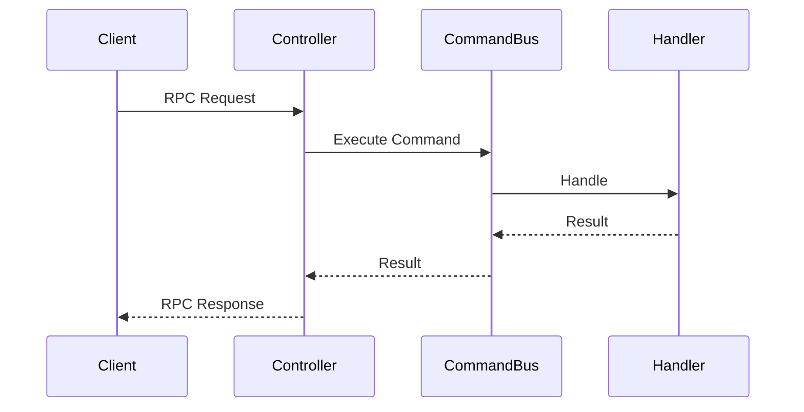

# Microservices Communication

## Overview

Our architecture utilizes two primary types of inter-service communication:

1. Event Bus - for asynchronous communication and events
2. RPC (Remote Procedure Call) - for synchronous communication between services

### Comparison Diagram



## Event Bus

### Concept

Event Bus is used for asynchronous communication between services, where:

- Publisher emits an event without expecting a response
- One or more subscribers can process the event
- Message delivery is guaranteed
- Immediate processing is not required

### Common Use Cases

1. State updates between services
2. Triggers for asynchronous processes
3. Change notifications

### Event Structure

```typescript
interface EventMetadata {
  eventId: string;
  timestamp: Date;
  version: string;
  source: string;
}

interface DomainEvent<T> {
  metadata: EventMetadata;
  payload: T;
}
```

### Event Examples

- player.registered
- player.document.sent
- player.document.rejected
- player.document.approved

## RPC (Remote Procedure Call)

### Concept

RPC is used for synchronous communication between services, where:

- Sender expects an immediate response
- Communication follows request-response pattern
- Optimized for fast interaction
- Data validation is required

### Common Use Cases

1. Requests requiring immediate response
2. Transactional operations
3. Critical data queries

### Interaction Structure



## Implementation

### DTO-First Approach

Using an approach where DTO is the central element in defining the interaction contract:

```typescript
@RemoteProcedureDto('account.applyTransaction')
export class AccountApplyTransactionDto {
  // DTO properties define the contract
}
```

### Controller (Service Provider)

```typescript
@Controller()
export class AccountController {
  @MessagePatternDto(AccountApplyTransactionDto)
  async applyTransaction(@Payload() dto: AccountApplyTransactionDto) {
    const command = new AccountApplyTransactionCommand(dto);
    return this.commandBus.execute(command);
  }
}
```

### Client (Service Consumer)

```typescript
@Injectable()
export class BalanceClient {
  async applyTransaction(dto: ApplyTransactionRequest) {
    return firstValueFrom(this.client.send(getMessagePatternFromDto(AccountApplyTransactionDto), dto));
  }
}
```

## Architecture Benefits

1. Clear separation of synchronous and asynchronous communication
2. Type-safety through DTO-first approach
3. Centralized validation using decorators
4. Easy transport layer switching
5. Scalability and reliability

## Best Practices

1. Use Events for:

   - State updates between services
   - Notifications
   - Asynchronous operations

2. Use RPC for:

   - Critical operations
   - Operations requiring immediate response
   - Transactional operations

3. Validation:

   - Using decorators for validation
   - Typing through DTOs
   - Contract versioning

4. Error Handling:

   - Retry mechanisms for event bus
   - Timeout for RPC calls
   - Circuit breaker for critical operations

5. Monitoring:
   - RPC call tracing
   - Event queue monitoring
   - Performance metrics

## Security

1. Inter-service Authentication
2. Sensitive Data Encryption
3. Input Validation
4. Access Control for Events and RPC Endpoints

## Additional Considerations

### Eventual Consistency

- Event-based communication naturally leads to eventual consistency
- Services should be designed to handle temporary inconsistencies
- Implementation of compensation/rollback mechanisms

### Fault Tolerance

1. Circuit Breakers:

   - Prevent cascading failures
   - Handle service unavailability
   - Graceful degradation

2. Retry Policies:
   - Exponential backoff
   - Maximum retry attempts
   - Dead letter queues

### Performance Optimization

1. Connection Pooling
2. Message Batching
3. Caching Strategies
4. Load Balancing

### Debugging and Tracing

1. Correlation IDs
2. Distributed Tracing
3. Logging Standards
4. Monitoring Metrics

### Testing Strategies

1. Integration Testing:

   - Service-to-service communication
   - Event handling
   - RPC interactions

2. Contract Testing:

   - DTO validation
   - Message patterns
   - Event schemas

3. Performance Testing:
   - Latency measurements
   - Throughput testing
   - Load testing
